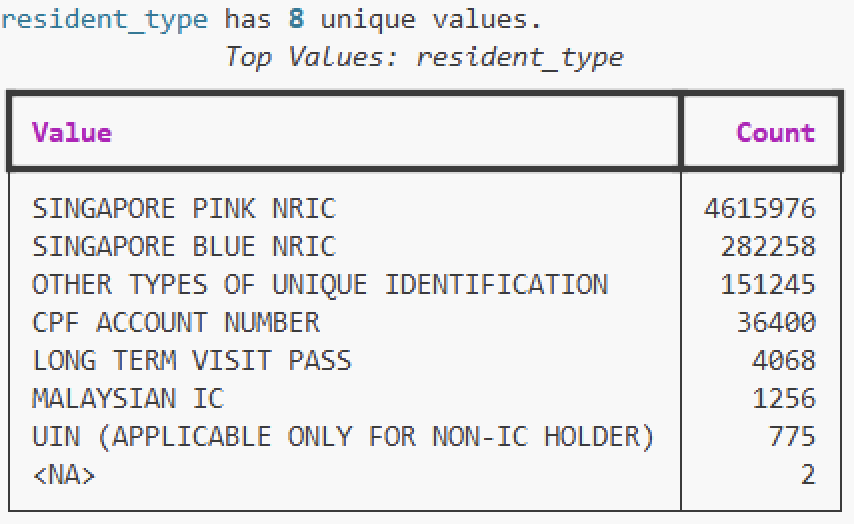

# Imported: dataset sections from an analysis project's data context

> **Working notes, not documentation.** Carried over verbatim (except for the redactions
> listed below) from the data-context file of an analysis project that used SingCLOUD.
> Retained for traceability — the `datasets/*.md` pages are built from this. Where the two
> disagree, the dataset pages are the reviewed version.
>
> **Removed during import:** the study's ICD-10 code list and comorbidity-index
> definitions, cohort definitions, sample sizes, statistical results, pipeline
> intermediate-file inventories, population denominators, and the section on that project's
> own unresolved merge failures. Incidental references to that project's pipeline steps
> ("Usage: Step 08…") remain in the per-dataset rows and can be ignored.
>
> **Redacted during import:** S3 bucket names and object paths.
>
> Source: `DATA_CONTEXT.md`, sections 2 and 6.

---

## 2. Source Datasets

### 2.1 MediClaims (Diagnosis Records)

| Property | Value |
|----------|-------|
| Alias pattern | `mediclaims_diag_{year}` (2015-2023) |
| Source | National health insurance claims |
| Granularity | One row per diagnosis event |
| Key columns | `PATIENT_ID`(uin), `diagcode` (ICD-10), `diagdesc`, `dischargedate` |
| Size | Millions of rows per year |
| Notes | ICD-10 codes appear both with dots (`I21.0`) and without (`I210`). Both formats must be handled. |

**Usage in pipeline**:
- Step 1: Scan all 9 years for IHD codes (I21.x, I22.x)
- Step 3: Scan for comorbidity ICD-10 codes (CCI components)
- Step 7: Discovery scan for all ICD-10 codes matching CCI patterns

### 2.1.1 Mediclaims (Epi)
A more detailed version of the diagnosis records, critically, provides more information on patient "admission_date", and "resident_type":

In this case, for the column `resident_type`, we are trying to filter for the values 'SINGAPORE PINK IC' and 'SINGAPORE BLUE IC'
Because we are also conducting this analysis in a way that ensures that we only get singapore citizens which would be the ones who would be using Mediclaims, not others.

### 2.2 COVID Case Registry

| Property | Value |
|----------|-------|
| Alias patterns | `ConfirmedCaseHeadersForAgenciesCNo0to100000`, etc. (7 chunks) |
| Source | National COVID-19 confirmed case registry |
| Granularity | One row per confirmed COVID case |
| Key columns | `uin`, `notificationdate`, `age`, `gender` / `cat_gender`, `cat_passtype` |
| Coverage | All confirmed COVID-19 cases in Singapore (citizens, PRs, and non-residents) |
| Citizen filter | `cat_passtype` column: `'SINGAPORE CITIZEN'` or `'PERMANENT RESIDENT'` for SG residents. Other values (work permits, dependant passes, etc.) are non-residents. |
| Notes | Split into chunks by case number ranges + two date-specific files (Dec 2022, Jan 2023). Column names are lowercased on load. |

**Full list of COVID registry aliases** (from config.yaml):
1. `ConfirmedCaseHeadersForAgenciesCNo0to100000`
2. `ConfirmedCaseHeadersForAgenciesCNo100000to200000`
3. `ConfirmedCaseHeadersForAgenciesCNo200000to300000`
4. `ConfirmedCaseHeadersForAgenciesCNo300000to400000`
5. `ConfirmedCaseHeadersForAgenciesCNo400000to500000`
6. `ConfirmedCaseHeadersForAgencies1Dec2022`
7. `ConfirmedCaseHeadersForAgencies1Jan2023`

### 2.3 Death Registry

| Property | Value |
|----------|-------|
| Alias | `death_registry` |
| Source | National death registration |
| Granularity | One row per death event |
| Key columns | `PATIENT_ID`, `DATE_OF_DEATH`, `CAUSE_OF_DEATH` (ICD-10) |
| Usage | Mortality outcome in KM analysis, Table 1 statistics |

### 2.4 SingCLOUD — Demographics

| Property | Value |
|----------|-------|
| Gender alias | `SingCLOUD_gender` |
| DOB alias | `SingCLOUD_DOB` |
| Source | National patient master index |
| Key columns | `PATIENT_ID`, `GENDER` / `SEX`, `DATE_OF_BIRTH` |
| Usage | Step 3: Enrich cohort with age and sex |

### 2.4 SingCLOUD - Event Diagnosis
*[Screenshot omitted during import: the original showed the catalogue entry for
`Event_Diagnosis_P1` including its full S3 bucket path. The facts it carried — source
filename `VW_EVENT_DIAGNOSIS_F_Export_31-07-2024_P1.csv`, 5,084,554 rows, and the full
column list — are recorded in
[datasets/singcloud-event-diagnosis.md](../../datasets/singcloud-event-diagnosis.md).]*
Broken into 8 parts: Event_Diagnosis_P{1-8}

Patient ID: PATIENT_ID_EXTN_X
Visit Date: VISIT_ADMIN_DATE_Z
Diagnosis Name: DIAGNOSIS_NAME_TXT
Diagnosis Code: DIAGNOSIS_NAME_ETS_ID
General Diagnosis Categlory: DIAGNOSIS_NAME_TXT_STD
Hospital: EVN_FACILITY_EXTN

### 2.5 SingCLOUD — Medications

| Property | Value |
|----------|-------|
| Alias pattern | `SingCLOUD_medication_items{n}` (n = 1 to 29) |
| Source | National medication dispensing records |
| Granularity | One row per dispensed medication |
| Key columns | `PATIENT_ID`, `MEDICATION_NAME` / `DRUG_NAME`, `DISPENSE_DATE` |
| Size | 29 chunks (large dataset) |
| Usage | Step 3: Flag medication classes (Statin, Antiplatelet, Antihypertensive) by keyword matching |

**Medication keywords** (from config.yaml):
- **Statin**: `statin`
- **Antiplatelet**: `aspirin`, `clopidogrel`, `ticagrelor`, `prasugrel`, `dipyridamole`, `cilostazol`
- **Antihypertensive**: `pril`, `sartan`, `olol`, `dipine`, `furosemide`, `hydrochlorothiazide`

### 2.6 COVIDFACILLOS — COVID Facility & Severity Data

| Property | Value |
|----------|-------|
| Alias | `COVIDFACILLOS` |
| Source | COVID-19 facility management system |
| Granularity | One row per COVID case (may have duplicates per patient if multiple admissions) |
| Rows | ~2,349,112 |
| Date range | 2020-01-22 to 2024-02-28 |
| Date format | `%d%b%Y` (e.g. `15Mar2021`) |
| Key columns | `uin`, `notificationdate`, `Casenumber`, `CaseClass`, `age`, `gender`, `race` |
| Severity columns | `LOS` (length of stay), `DaysInICU`, `Deceased`, `O2StartDate`, `O2EndDate` |
| Vaccination columns | `vacc_date1`–`vacc_date5`, `vaccbrand1`–`vaccbrand5`, `VaccinationFourthDoseDate` |
| Other columns | `passtype`, `flattype`, `Exposuretype`, `CPlus`, `AGPlus`, `EarliestEDVisit`, `EDVisits`, `HistoricalStatus`, `Status` |
| Usage | Step 10: Primary source for COVID severity, race, and backup vaccination data |

### 2.7 NIRListtruncated — National Immunisation Registry

| Property | Value |
|----------|-------|
| Alias | `NIRListtruncated` |
| Source | National Immunisation Registry (NIR) |
| Granularity | One row per person |
| Rows | ~6,174,098 |
| Key columns | `uin`, `vacc_date1`–`vacc_date6`, `vaccbrand1`–`vaccbrand6` |
| Notes | Most comprehensive vaccination source. Covers up to 6 doses (vs 5 in COVIDFACILLOS). Covers ALL residents, not just COVID cases. |
| Usage | Step 10: Primary vaccination data source for all patients (G1, G2, G3) |

### 2.8 COVID Reinfections

| Property | Value |
|----------|-------|
| Alias | `COVID Reinfections` |
| Source | COVID-19 reinfection surveillance |
| Granularity | One row per reinfection event |
| Rows | ~128,101 |
| Key columns | `uin`, `notificationdate`, `Casenumber`, `CaseClass`, `age`, `reinfection_type`, `HistoricalStatus` |
| Demographics | `cat_gender`, `cat_race`, `cat_passtype`, `cat_flattype` (note: prefixed with `cat_`) |
| Severity columns | `DaysAtPHI`, `DaysAtCTF`, `DaysAtCIF`, `DaysAtCIFM`, `DaysAtDRF`, `DaysAtHRP`, `DaysO2`, `DaysInICU`, `Deceased` |
| Vaccination columns | `vacc_date1`–`vacc_date5`, `vaccbrand1`–`vaccbrand5` |
| Usage | Step 10: Reinfection flag + supplementary race data |

### 2.9 FacilityUtilizationLOSSubsequentRI — Reinfection Facility Use

| Property | Value |
|----------|-------|
| Alias | `FacilityUtilizationLOSSubsequentRI` |
| Source | Facility utilisation for confirmed reinfected COVID patients |
| Granularity | One row per reinfection episode |
| Rows | ~2,319 |
| Key columns | `uin`, `notificationdate`, `Age`, `Gender`, `reinfection_type`, `reinfno`, `prev_reinf_notif` |
| Severity columns | `DaysAtPHI`, `DaysAtCTF`, `DaysAtCIF`, `DaysAtCIFM`, `DaysInICU`, `DaysO2`, `NRDate` |
| Vaccination columns | `vacc_date1`–`vacc_date5`, `vaccbrand1`–`vaccbrand5` |
| Usage | Step 10: Additional reinfection flag source |

### 2.10 Serology_Tests_COVID — Serology Results

| Property | Value |
|----------|-------|
| Alias | `Serology_Tests_COVID` |
| Source | COVID-19 serology testing programme |
| Granularity | One row per serology test |
| Rows | ~1,067,600 |
| Key columns | `uin`, `accesionno`, `serologyswabdate`, `serologyresultdate` |
| Result columns | `serologyswabstatus`, `serologyresult`, `serologyctvalue`, `serologyresultindicator`, `serologyvalue` |
| Lab columns | `serologylab`, `serologyswablocation`, `serologylabinterpretationnote` |
| Metadata | `createdat`, `createdby`, `updatedat`, `updatedby` |
| Usage | Step 10: Serology result and CT value (viral load proxy) linked to earliest test per patient |

### 2.11 Laboratory Items — SingCLOUD Lab Results

| Property | Value |
|----------|-------|
| Aliases | `VW_LABORATORY_ITEM_FIL_F_Export_{date}_P{n}` (n=1-22, dates: 28/29/30-07-2024) |
| Source | National patient lab test results (SingCLOUD) |
| Granularity | One row per lab test result |
| Total parts | 22 |
| Key columns | `PATIENT_ID_EXTN_X` (patient ID), `ITEM_NAME_ORI_TXT` (test name, free text), `ITEM_NUMERIC_VALUE` (result), `DISPLAY_DATE_Z` (date/time), `FACILITY_EXTN` (hospital) |
| Other columns | `ITEM_NUMERIC_VALUE_UOM` (unit), `ITEM_REFERENCE_RANGE`, `ITEM_ABNORMAL_FLAG_ORI_TXT`, `BATTERY_ID_ROOT`, `ITEM_SEQ_NO` |
| Usage | Step 08: CRP, ESR, Creatinine, Albumin extraction for lab marker analysis |
| Notes | Test names are free text — keyword matching required. Partition dates vary (P1-4: 28-07, P5-13: 29-07, P14-22: 30-07). |

**Lab markers analysed:**
- **CRP** (C-Reactive Protein): keywords `c-reactive`, `crp`, `hs-crp`
- **ESR** (Erythrocyte Sedimentation Rate): keywords `erythrocyte sedimentation`, `esr`
- **Creatinine**: keywords `creatinine`, `creat`
- **Albumin**: keywords `albumin`

---

---

## 6. Data Considerations

1. **Memory management**: MediClaims and SingCLOUD medication data are very large. Load one year/chunk at a time using the DataCatalog. The `inject_into()` method prints memory usage and headroom.

2. **Column naming**: Column names may vary slightly between datasets and years. Always inspect `df.columns` before assuming a column exists. Common variations: `PATIENT_ID` vs `patient_id` vs `PatientID`.

3. **Date formats**: Dates may appear as strings in various formats (`YYYY-MM-DD`, `DD/MM/YYYY`, etc.). Always parse explicitly with `pd.to_datetime(df['col'], format=...)` or use `dayfirst=True` if ambiguous.

4. **Duplicate patients**: A patient can appear in MediClaims multiple times (multiple diagnoses). Cohort assignment uses the *first* qualifying event. Always deduplicate to patient-level before analysis.

5. **Missing data**: SingCLOUD demographic linkage is not 100%. Some patients in MediClaims may not have gender/DOB records. Handle missing demographics gracefully.

6. **ICD-10 dot inconsistency**: Critical — codes appear as both `I21.0` and `I210`. All regex patterns and lookups must account for optional dots. The config.yaml lists both variants.

